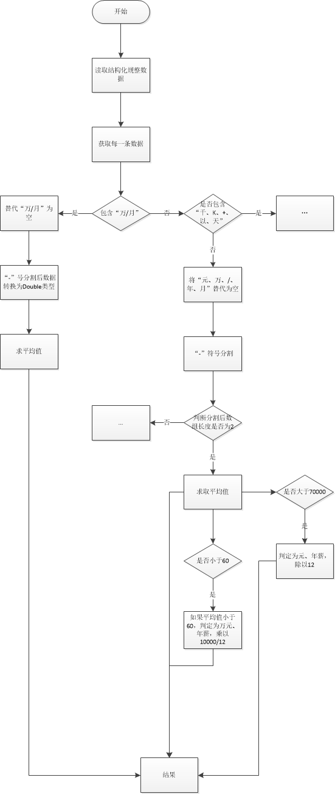

# mapReduceSalary
本项目是DataOperate的扩展，扩展内容主要是练习mapReduce，在查阅本代码之前可以参考项目[DataOperate](https://github.com/hautxuhaihu/DataOperate).  

## 本项目实现了以下的前十个要求：  
根据资料中的大数据数据  

1、本地读取数据进行文件上传到hdfs

2、对数据进行清洗，清洗步骤删除薪资列“面议”，经验列“不限经验”，逗号分隔超过8行，重复列数据清除

3、对薪资列进行规范化处理, 

4、对岗位列进行规范化处理	//12345可以写在一起

5、对经验列规范化处理

6、统计全国大数据平均工资	//输出结果

7、统计全国各个岗位大数据平均薪资	//输出结果

8、统计全国不同城市的大数据平均薪资（城市作为键，统计所有薪资的总和，最后所有数据进行二次合并）

9、统计不同城市大数据，不同岗位，平均薪资，岗位数量，岗位中不同工作年限的百分比 //按城市分开

10、统计全国不同工作经验的平均薪资、最高薪资、最低薪资（以经验作为键，统计平均薪资，最高薪资、最低薪资）

12、统计各个地区的不同工作 经验的平均薪资（以城市进行分区，以经验进行分区，统计平均薪资）

13、统计全国大数据招聘公司数量

14、统计不同城市大数据招聘公司数量及对比

15、统计不同城市不同岗位大数据，不同工作经验工资最高的公司以及薪资

16、统计不同城市提供大数据招聘岗位最多的公司名称和岗位内容

17、不同薪资范围的公司信息，不同城市的数量对比

18、不同公司提供薪资与同行薪资对比

19、统计各个职位同工作经验高于全国平均薪资的公司，工资等信息

20、统计不同城市，相同工作经验的薪资对比

## 程序结构说明  
1-5题为数据规范化处理，一套map reduce 主要用于 **数据规范化** ，程序实现为SalaryStandardMapper，SalaryStandardReducer，SalaryStandardDriver

6-10题实在前5题规范化的输出的数据基础上进行的统计操作
第6题的实现程序为CountNationalAvgDriver，CountNationalAvgMapper,GetAvgSalaryReducer

第7题的实现程序为CountEveryJobAvgDriver，CountEveryJobAvgMpper，GetAvgSalaryReducer

第8题的实现程序为CountEveryCityAvgDriver，CountEveryCityAvgMapper，GetAvgSalaryReducer

第9题的实现程序为SalaryStatisticsDriver，SalaryStatisticsMapper，SalaryStatisticsReducer，SalaryPartitioner

第10题的实现程序为CountEveryExpAvgDriver，CountEveryExpAvgMapper，CountEveryExpAvgReducer

